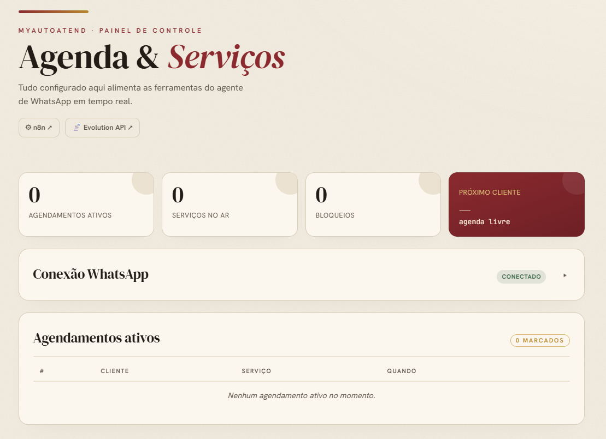

<div align="center">

<br>

# MyAutoAtend

### Agendamento de serviços por IA no WhatsApp

Atendente virtual que conversa, agenda, remarca e cancela — sozinho.
Serve qualquer negócio com hora marcada: **clínicas · petshops · salões · consultórios · estúdios**.

<br>


<br>
<br>



</div>

<br>

---

## ⌖ O que você ganha

| | |
|---|---|
| 💬 **Atende no WhatsApp** | Texto, áudio (transcrição) e imagem. Conversa natural, lembra do contexto. |
| 📅 **Gerencia a agenda** | Agenda, remarca e cancela. Bloqueia horários e fecha datas. |
| 🛠️ **Painel do dono** | Em `/admin`: cadastre serviços, veja agendamentos e opere tudo no navegador. |
| 🔌 **Sobe sozinho** | Um `docker compose up` provisiona, configura e publica tudo. |

<br>

## ⚙ Configuração

> **Pré-requisitos:** [Docker](https://docs.docker.com/get-docker/) + Docker Compose v2 · uma chave da [OpenAI](https://platform.openai.com/api-keys) · portas `5678` e `9090` livres.

### 1 · Clonar

```bash
git clone https://github.com/iurijw/MyAutoAtend.git
cd MyAutoAtend
```

### 2 · Preencher o `.env`

```bash
cp .env.example .env
```

Abra o `.env` e ajuste **no mínimo** estes valores:

| Variável | O que é |
|---|---|
| `OPENAI_API_KEY` | Sua chave da OpenAI — **obrigatória** |
| `POSTGRES_PASSWORD` · `AUTHENTICATION_API_KEY` | Senhas fortes que você escolhe |
| `N8N_OWNER_EMAIL` · `N8N_OWNER_PASSWORD` | Login do painel n8n |
| `MCP_OWNER_PHONE` | Seu WhatsApp (E.164, ex. `5599999999999`) — autoriza ações de dono |
| `MCP_ADMIN_USER` · `MCP_ADMIN_PASS` | Login do painel `/admin` |
| `AGENT_SYSTEM_PROMPT` | Personalidade e regras do atendente (já vem um exemplo genérico) |

### 3 · Subir

```bash
docker compose up -d
```

A primeira inicialização leva alguns minutos. Acompanhe (se quiser):

```bash
docker logs -f n8n
```

Espere por: `✔ Workflow "Agente Whatsapp" importado e publicado!`

### 4 · Conectar o WhatsApp e Configurar Serviços (entre outras opções)

Abra **http://localhost:8000/admin** (login = `MCP_ADMIN_USER` / `MCP_ADMIN_PASS`) e conecte seu Whatsapp via QRCode, bem como, cadastre os serviços. **Pronto** — o atendente já responde.

<br>

## ▦ Painéis

| Painel | Endereço | Para quê |
|---|---|---|
| **Admin** (agendamentos) | http://localhost:8000/admin | Serviços, agenda e bloqueios |
| **n8n** | http://localhost:5678 | Editar o fluxo do agente |
| **Evolution API** | http://localhost:9090 | Conexão do WhatsApp |

<br>

## ⌁ Comandos úteis

```bash
docker compose up -d        # subir tudo
docker compose down         # parar (mantém os dados)
docker compose down -v      # parar e APAGAR todos os dados
docker logs -f n8n          # ver a inicialização
```

<br>

## Todo

- [X] Adicionar novas opções de provedores de IA (chave/modelo atualizados no n8n pelo portal admin; fluxo unidirecional — a chave nunca é exibida de volta)
- [X] Transferir lógica de pareamento do Whatsapp para o portal admin
- [X] Adicionar shortchuts para abertura dos portais auxiliares (Evolution API e n8n) no portal admin
- [ ] Visualizacao de agendamentos com foto e número do Whatsapp no portal do admin
- [ ] Poder bloquear/fechar range de datas pelo portal do admin e conversa com o bot no WhatsApp
- [ ] Adicionar alguma forme de controlar o contexto do agente no nodo do n8n pelo portal do admin, atualmente definido na inicialização via .env (AGENT_SYSTEM_PROMPT)
- [ ] Adicionar opção de avisar o cliente que foi reagendado/cancelado o serviço dele (a IA avisar a ação do dono/adminsitrador com o aval do mesmo)
- [ ] Adicionar a opção de ativar (no painel de admin ou pedindo para o bot no whatsapp) o aviso para o Whatsapp do dono/administrador de agendamentos/cancelamentos, etc...

<br>

---

<div align="center">

Construído com **Docker · n8n · Evolution API · OpenAI · FastMCP · PostgreSQL · Redis**

<sub>Licença MIT</sub>

</div>
