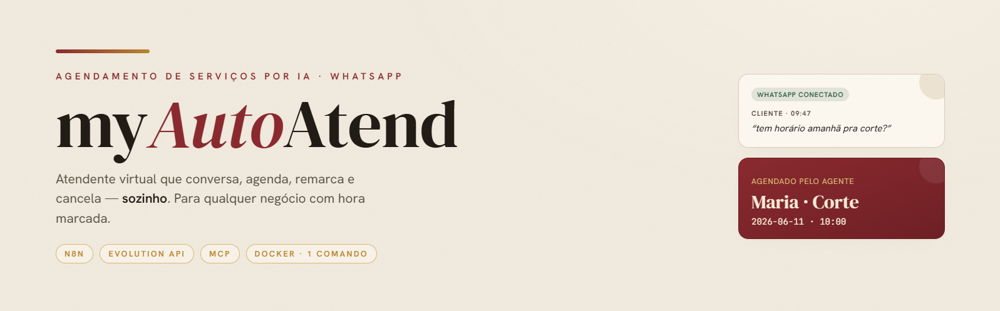
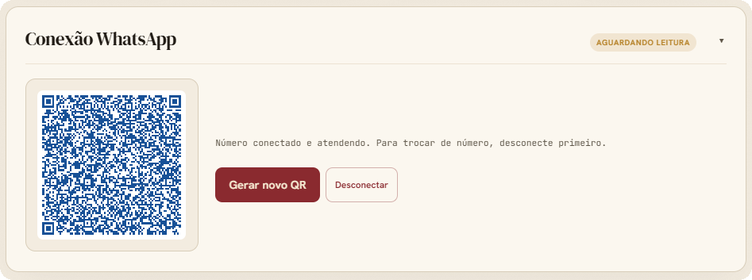
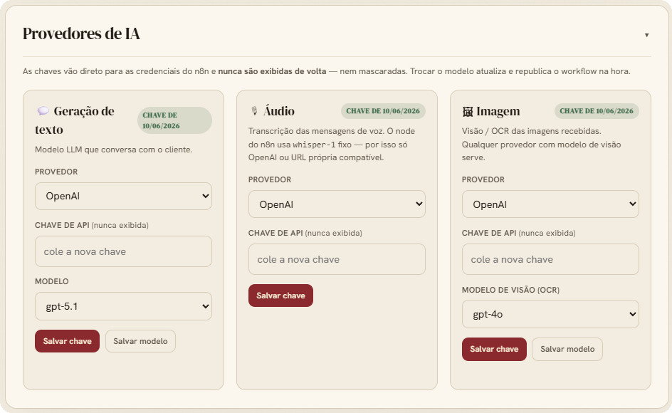
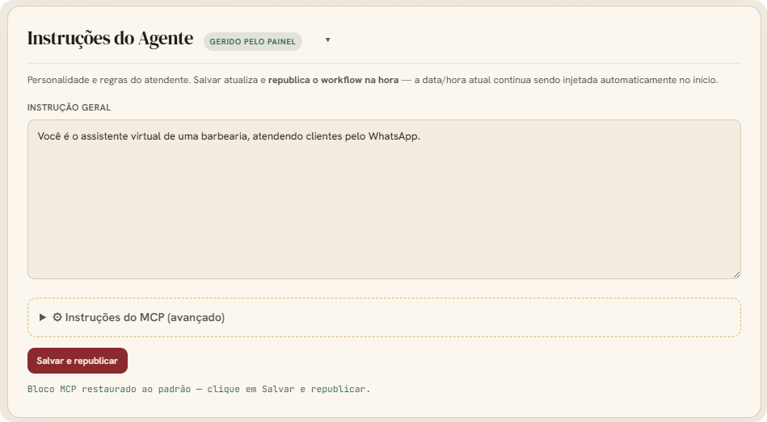

<div align="center">

<br>

# MyAutoAtend



### Agendamento de serviços por IA no WhatsApp

Atendente virtual que conversa, agenda, remarca e cancela — sozinho.
Serve qualquer negócio com hora marcada: **clínicas · petshops · salões · consultórios · estúdios**.

<br>


<br>
<br>

</div>

<br>

---

## ⌖ O que você ganha

| | |
|---|---|
| 💬 **Atende no WhatsApp** | Texto, áudio (transcrição) e imagem. Conversa natural, lembra do contexto. |
| 📅 **Gerencia a agenda** | Agenda, remarca e cancela. Bloqueia horários e fecha datas. |
| 🛠️ **Painel do dono** | Em `/admin`: cadastre serviços, veja agendamentos e opere tudo no navegador. |
| 🔌 **Sobe sozinho** | Um `docker compose up` provisiona, configura e publica tudo. |

<br>

## ⚙ Configuração

> **Pré-requisitos:** [Docker](https://docs.docker.com/get-docker/) + Docker Compose v2 · uma chave de algum provedor de IA (OpenAI, Anthropic, OpenRouter, etc.) · portas `8000` e `9090` livres.

### 1 · Clonar

```bash
git clone https://github.com/iurijw/MyAutoAtend.git
cd MyAutoAtend
```

### 2 · Definir login e senha (`.env`)

```bash
cp .env.example .env
```

O `.env` tem **apenas duas variáveis**, usadas em todos os portais:

```env
LOGIN=voce@exemplo.com
SENHA=TroqueEsta123
```

> Para trocar a senha depois, edite o `.env` e rode `docker compose up -d` de novo.

### 3 · Subir

```bash
docker compose up -d
```

A primeira inicialização leva alguns minutos. Acompanhe (se quiser):

```bash
docker logs -f mcp_agendamentos
```

Espere por: `AÇÃO NECESSÁRIA: conecte o WhatsApp — QR Code no painel /admin.`

### 4 · Configurar pelo painel

Em **http://localhost:8000/admin** (`LOGIN` / `SENHA`):

1. **📲 WhatsApp** — escaneie o QR Code.
2. **🧠 Chave de IA** — cole a chave e escolha os modelos. *Sem isso o atendente não responde.*
3. **📞 Telefone do dono** — em *Configuração geral*.
4. **🛠 Serviços** — cadastre com preço e duração.

**Pronto** — o atendente já responde no WhatsApp.

<br>

## ▦ Painéis

| Painel | Endereço | Para quê |
|---|---|---|
| **Admin** (agendamentos) | http://localhost:8000/admin | Serviços, agenda, WhatsApp, IA |
| **Evolution API** | http://localhost:9090 | Gerenciar instâncias WhatsApp |

> 🔑 Todos usam o mesmo acesso do `.env`: `LOGIN` / `SENHA` (na Evolution, a apikey é a `SENHA`).
>
> ⚠️ O painel `/admin` não foi projetado para ser exposto na internet — use apenas em `localhost`.

### Por dentro do `/admin`

<details>
<summary><b>📲 Conexão WhatsApp</b> — pareie pelo QR Code sem sair do painel</summary>
<br>

</details>

<details>
<summary><b>🧠 Provedores de IA</b> — provedor, chave e modelo por uso: texto · áudio · imagem</summary>
<br>

</details>

<details>
<summary><b>✍️ Instruções do Agente</b> — edite a personalidade do atendente e republique na hora</summary>
<br>

</details>

<br>

## ⌁ Comandos úteis

```bash
docker compose up -d        # subir tudo
docker compose down         # parar (mantém os dados)
docker compose down -v      # parar e APAGAR todos os dados
docker logs -f mcp_agendamentos   # ver a inicialização e o agente
```

<br>

## Todo

- [X] Adicionar novas opções de provedores de IA (chave/modelo atualizados no n8n pelo portal admin; fluxo unidirecional — a chave nunca é exibida de volta)
- [X] Transferir lógica de pareamento do Whatsapp para o portal admin
- [X] Adicionar shortchuts para abertura dos portais auxiliares (Evolution API e n8n) no portal admin
- [X] Visualizacao de agendamentos com foto e número do Whatsapp no portal do admin
- [ ] Poder bloquear/fechar range de datas pelo portal do admin e conversa com o bot no WhatsApp
- [X] Adicionar alguma forme de controlar o contexto do agente no nodo do n8n pelo portal do admin, atualmente definido na inicialização via .env (AGENT_SYSTEM_PROMPT) — card "Instruções do Agente": instrução geral + bloco MCP separado (avançado, com aviso e restauração do padrão)
- [ ] Adicionar opção de avisar o cliente que foi reagendado/cancelado o serviço dele (a IA avisar a ação do dono/adminsitrador com o aval do mesmo)
- [ ] Adicionar a opção de ativar (no painel de admin ou pedindo para o bot no whatsapp) o aviso para o Whatsapp do dono/administrador de agendamentos/cancelamentos, etc...
- [ ] Opção de abrir conversa (abre um modal) no portal de admin, para visualizar as mensagens do whatsapp, com possibilidade de enviar mensagens manualmente pelo bot. Deste modo, como dependencia, deve-se criar uma aba nova de conversas (além de colocar um botão para abrir a conversa na listagem de agendamentos).
- [ ] Botão no painel admin e comando via whatsapp para o bot parar de responder uma pessoa/numero de whatsapp especifico.
- [ ] Opção de esconder menus do painel do admin (por exemplo, conexão do whatsapp)... Os menus podem ser anexado novamente na pagina clicando em uma engrenagem no canto da página.
- [ ] Adicionar opção de outros provedores de whisper (speech to test)
- [ ] Adicionar opção de geração de audio pelo bot (para pessoas que não sabem ler e escrever)
- [ ] Adicionar instrução no readme de como atualizar o programa sem perder os dados
- [ ] Adicionar parte no painel de admin para baixar os dados (backup geral) e opção de importar novamente os dados.
- [ ] Adicionar dark mode no painel de admin
- [ ] Adicionar controle financeiro dos agendamentos (uma nova seção na UI e controle pelo bot), sendo possivel criar contas bancárias... Nesse contexto, criar botão para marcar o agendamento como conluído e forma e valor recebido (valor auto preenchido, mas ajustavel, de acordo com o valor do serviço cadastrado).

<br>

---

<div align="center">

Construído com **Docker · PydanticAI · Evolution API · OpenAI · FastMCP · PostgreSQL · Redis**

<sub>Licença MIT</sub>

</div>
